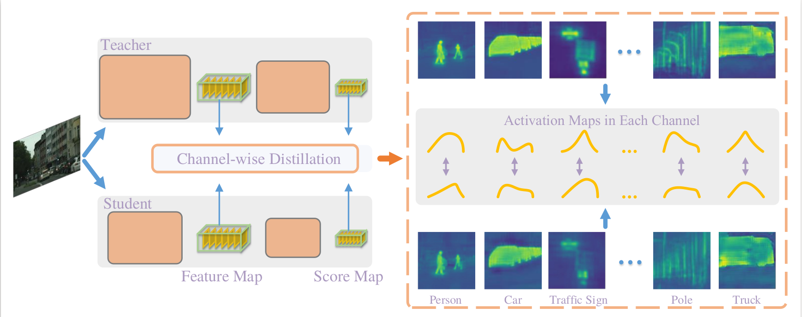

# Channel-wise Knowledge Distillation for Dense Prediction

## Performance on the Cityscape dataset
We apply the distillation method to training the [PSPNet](https://arxiv.org/abs/1612.01105). We used the dataset splits (train/val/test) provided [here](https://github.com/speedinghzl/pytorch-segmentation-toolbox). We trained the models at a resolution of 512x512.


### Checkpoints

new_rn18-cityscape_singleAndWhole_val-75.02_test-73.86.pth [[Google Drive]](https://drive.google.com/file/d/1eLOslSm1Clif_PJFTedbmG9fdhhqPSAe/view?usp=sharing)

new_rn18-cityscape_singleAndWhole_val-75.90_test-74.58.pth [[Google Drive]](https://drive.google.com/file/d/1IWGQvoP8OMcRysHPMPmXAjWi8k7IW3ZZ/view?usp=sharing)


## Introduction
This repository is the official implementation for Channel-wise Knowledge Distillation for Dense Prediction, ICCV 2021. The channel-wise distillation is simple and effective. We have domenstrate the effectiveness on semantic segmentation and object detection.




This repository contains the PyTorch implementation for the semantic segmentation experiments on Cityscapes. 

To reproduce other experiments, please refer to the following links:

Experiments on Pascal VOC and Ade20K: https://github.com/pppppM/mmsegmentation-distiller 

Experiments on object detection: https://github.com/pppppM/mmdetection-distiller


## Requirements

All the codes are tested in the following environment:

* Linux (tested on Ubuntu 16.04)
* Python 3.6.2
* PyTorch 0.4.1

## Installation

* Install PyTorch: ` conda install pytorch=0.4.1 cuda90 torchvision -c pytorch `
* Install other dependences: ` pip install opencv-python scipy `
* Install InPlace-ABN:
```bash
cd libs
sh build.sh
python build.py
``` 
The `build.sh` script assumes that the `nvcc` compiler is available in the current system search path.
The CUDA kernels are compiled for `sm_50`, `sm_52` and `sm_61` by default.
To change this (_e.g._ if you are using a Kepler GPU), please edit the `CUDA_GENCODE` variable in `build.sh`.

## Dataset & Models

* Dataset: [[Cityscapes]](https://www.cityscapes-dataset.com/)

* Teacher: PSPNet (ResNet-101) trained on Cityscapes [[Google Drive]](https://drive.google.com/file/d/1epiJnLiPYSAgT2IHP0UhYkTSRMb8twpJ/view?usp=sharing)

* Student: ResNet-18 pretrained on ImageNet [[Google Drive]](https://drive.google.com/file/d/17ewTEr-FZ8x0Lc9XMMR5VbgOupq48s9q/view?usp=sharing)

Please create a new folder `ckpt` and move all downloaded models to it.

## Usage

#### 1. Trainning with evaluation


To train a model only with channel-wise distillation on the logits map.

```bash
bash exp_cwd.sh channel kl 3 4 False False False v1
```

There are some fluctuations in the result, from 74.6~75.0. We report the average results in the paper.

To train a model with channel-wise distillation, GAN loss and Pixel-wise distillation.

```bash
bash exp_cwd.sh channel kl 3 4 True True False v1
```


## Citation

Please consider citing this work if it helps your research:


```bash
@inproceedings{wang2020ifvd,
  title={Channel-wise Knowledge Distillation for Dense Prediction},
  author={Shu, Changyong and Liu, Yifan and Gao, Jianfei and Zheng, Yan and Shen, Chunhua},
  booktitle={ICCV},
  year={2021}
}

```

## Acknowledgment
Thanks [[Changyong Shu]](https://github.com/drilistbox) and [[Jianfei Gao]](https://github.com/pppppM) for their valuable contribution.
This codebase is heavily borrowed from [IFVD](https://github.com/YukangWang/IFVD).
